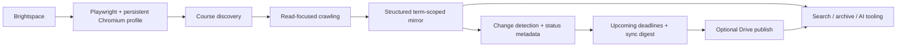

# Brightspace Sync

[](https://github.com/aryanramz/brightspace-sync/actions/workflows/ci.yml)
[](https://github.com/aryanramz/brightspace-sync/releases/latest)
[](LICENSE)
[](https://nodejs.org/)

**Keep a structured, term-aware local mirror of the Brightspace content you can already access.**

Brightspace Sync is a read-focused authenticated crawler and incremental course-mirroring pipeline for D2L Brightspace. It uses Playwright with a persistent Chromium/Brave profile, discovers courses dynamically, captures student-visible course data, tracks meaningful changes, and optionally publishes the mirror to a Google Drive for desktop folder for downstream search or AI workflows.

> This project is unofficial and is not affiliated with, endorsed by, or supported by D2L or any educational institution. Users are responsible for complying with their institution's policies, applicable terms of service, and copyright rules.

## Why this exists

Brightspace is useful as a live LMS, but less convenient as a durable personal archive or machine-readable knowledge source. Brightspace Sync turns the student-visible parts of an account into a predictable filesystem structure that can be searched, diffed, archived by semester, or connected to downstream tooling.

Typical use cases include:

- keeping a personal semester archive
- checking what changed since the last sync
- searching course material outside the LMS UI
- feeding a private course mirror into retrieval or AI tooling
- maintaining a local copy of assignments, announcements, course content, and supported files

## Highlights

- Persistent browser-session reuse with normal SSO/MFA when required
- Dynamic course discovery
- Quick and Full synchronization modes
- Term-aware historical archive structure
- Change detection that normalizes common Brightspace UI noise
- Cross-course upcoming-deadlines index for assignments, quizzes, and calendar events
- Human-readable and machine-readable sync digests
- Student-visible assignments, quizzes, grades, announcements, calendar, discussions, and course content
- Selective asset downloading with configurable size limits
- Incremental Google Drive for desktop publishing
- Shared process locking to prevent overlapping sync/publish operations
- Smart scheduled sync: Quick normally, Full after the configured interval
- Windows launchers and Task Scheduler friendly operation
- Local status, manifest, and change metadata for downstream tooling

## Architecture



This is closer to an authenticated synchronization pipeline than a one-off scraper.

## Example output

The repository includes a **fully synthetic sample mirror** so you can inspect the output format without exposing real course or student data:

[`examples/sample-mirror/`](examples/sample-mirror/)

```text
BrightspaceMirror/
├── 2026-Fall/
│   └── CSC 210 - Systems Programming [123456]/
│       ├── _course.json
│       ├── _course_status.json
│       ├── _latest_changes.json
│       └── assignments/
│           └── page.txt
├── _school/
│   ├── current.json
│   ├── upcoming.json
│   ├── upcoming.md
│   ├── sync-digest.json
│   └── sync-digest.md
└── _system/
```

Example Quick Sync behavior:

```text
Existing Brightspace session found — continuing without login.
Sync mode: QUICK
Courses discovered: 6
Changes: 1 added, 0 updated
Upcoming deadlines indexed: 12
Sync digest entries: 1
Drive publish: 7 copied, 2284 unchanged, 0 failed
Sync complete.
```

## Requirements

- Windows 10 or 11
- Node.js 20+
- Brave Browser or another compatible Chromium browser
- Access to a Brightspace environment through a normal student account
- Optional: Google Drive for desktop if using Drive publishing

## Quick start

1. Clone the repository and install dependencies:

   ```powershell
   git clone https://github.com/aryanramz/brightspace-sync.git
   cd brightspace-sync
   npm install
   ```

2. Copy the example configuration:

   ```powershell
   Copy-Item config.example.json config.json
   ```

3. Edit `config.json` and set at minimum:

   ```json
   {
     "baseUrl": "https://your-school.brightspace.com"
   }
   ```

4. Run the login setup helper:

   ```text
   SETUP_LOGIN.cmd
   ```

   Sign into your institution normally. SSO and MFA remain under your institution's control. Brightspace Sync does not require your password in code or configuration.

5. Run a Full sync first:

   ```text
   FULL_SYNC.cmd
   ```

6. Use Quick syncs for normal daily updates:

   ```text
   QUICK_SYNC.cmd
   ```

## Authentication model

The crawler uses a dedicated persistent Chromium profile under:

```text
.brightspace-profile/
```

If a valid Brightspace/SSO session exists, syncs can usually continue without another login.

If the session expires, the browser may require you to complete login and MFA manually. `SETUP_LOGIN.cmd` opens the same dedicated profile so you can establish or refresh authentication without storing credentials in project files.

The project does not require username or password fields in `config.json`.

## Sync modes

### Quick Sync

Designed for routine use. It checks high-value changing areas such as assignments, quizzes, grades, calendar, and announcements while skipping the deepest Content/module/discussion crawling for speed.

### Full Sync

Performs a deeper crawl including course Content/modules, discussions, supported assets, and additional verification work.

`SCHEDULED_SYNC.cmd` can automatically choose between Quick and Full based on the age of the last successful Full sync.

## Mirror layout

The local mirror uses a term-scoped schema:

```text
BrightspaceMirror/
├── 2026-Fall/
│   ├── Course A [123456]/
│   └── Course B [234567]/
├── 2027-Spring/
├── _school/
└── _system/
```

- **Term folders** contain full per-course mirror trees.
- **`_school/`** contains lightweight cross-course summaries and current-term indexes.
- **`_system/`** contains crawler schema, state, migration, debug, and publishing metadata. `_system/` is not published to Drive by default.

## Cross-course indexes

Every successful Quick or Full sync generates cross-course views under `_school/` before Drive publishing.

### `upcoming.json` and `upcoming.md`

The upcoming-deadlines index normalizes dated work across active courses into one list. It extracts upcoming assignments, quizzes, and calendar events, removes obvious duplicate calendar copies of assignment/quiz deadlines, and sorts everything chronologically.

Machine-readable items include fields such as:

```json
{
  "course": "CSC 210 - Systems Programming",
  "type": "assignment",
  "title": "Homework 2: Processes and Pipes",
  "dueAt": "2026-09-29T03:59:00.000Z",
  "dueDate": "2026-09-28",
  "deadlineBasis": "due",
  "url": "https://brightspace.example.edu/assignment/1002"
}
```

The same index is also written as Markdown for fast human or LLM retrieval. Active terms receive term-scoped copies under `_school/<term>/`.

### `sync-digest.json` and `sync-digest.md`

The sync digest turns raw change metadata into a compact cross-course summary of what was added or updated during the latest run. Student-facing changes are grouped separately from technical mirror changes such as asset-index/file updates.

This makes questions such as "what changed since the last sync?" and "what do I have due this week?" answerable from small, purpose-built files instead of scanning every course tree.

`_school/current.json` points to the current upcoming-deadlines and sync-digest files.

## Google Drive publishing

Drive publishing is optional and disabled by default in `config.example.json`.

The intended model is Google Drive for desktop in streaming or mirrored mode. Brightspace Sync copies the local mirror into a mounted Drive path rather than implementing OAuth itself.

The publisher is incremental: it copies new or changed files, leaves unchanged files alone, removes only files it previously published that were later removed locally, does not purge unrelated user files, and verifies tracked files during Full publishing.

To publish manually:

```text
PUBLISH_TO_DRIVE.cmd
```

## Scheduling

`SCHEDULED_SYNC.cmd` chooses a mode automatically:

- Quick if the last successful Full sync is newer than the configured interval
- Full once the configured Full interval has elapsed

This works well with a single daily Windows Task Scheduler task because a missed weekly Full is not permanently skipped just because the computer was offline at a specific scheduled time.

## Assets

The crawler can download common course assets such as PDF, DOC/DOCX, PPT/PPTX, XLS/XLSX, text files, images, archives, and caption files such as VTT/SRT.

Large video/audio binaries are index-only by default. Asset behavior and size limits are configurable.

## Privacy and safety

Brightspace Sync is designed to avoid submissions, edits, and other intentional state-changing operations. Visiting Brightspace pages can still update normal platform metadata such as viewed state or "Last Visited" information.

Never commit or share:

- `.brightspace-profile/` — browser cookies, sessions, and potentially saved-login information
- `BrightspaceMirror/` — private student/course content
- `config.json` — local machine configuration
- logs or exported data containing private academic information

These paths are ignored by the included `.gitignore`. See [SECURITY.md](SECURITY.md) for the full security model.

## Development

Run the included checks:

```powershell
npm run selftest
npm run publish-selftest
npm run lock-selftest
npm run school-indexes-selftest
npm run security-selftest
```

GitHub Actions runs supported checks on Node.js 20 and 22.

## Scope and compatibility

Brightspace deployments differ between institutions, and D2L can change its frontend without notice. This project is based on browser automation rather than an official D2L integration, so selectors may require maintenance over time.

The crawler is intended only for content visible to the signed-in user. It is not intended to bypass permissions, access restricted content, automate submissions, or evade institutional authentication controls.

## Release

Latest stable release: **[v2.2.0](https://github.com/aryanramz/brightspace-sync/releases/tag/v2.2.0)**

## License

Licensed under the [MIT License](LICENSE).